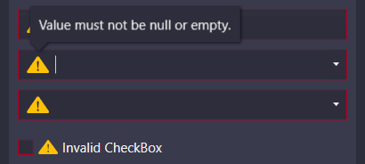

# Data validation

The data validation mechanism of WPF provides the ability to validate property values and assign error messages in case they are invalid. With AdonisUI, if a control binds to an invalid property the error is indicated in the control template by a red border and an error icon. The error message is displayed as a popup when the control gains keyboard focus or the user hovers over the icon. To set validation errors the interface `IDataErrorInfo` or `INotifyDataErrorInfo` from WPF can be used.

AdonisUI displays data validation errors for the following controls:

- TextBox
- PasswordBox
- ComboBox
- CheckBox




## Customization

### Colors

The error template makes use of `ErrorColor` for the control's border and `AlertColor` for the error icon. Both can be changed for each color scheme (see [Colors and Brushes](colors-and-brushes)).

### Validation message popup

By default the error message popup is displayed on keyboard focus and mouse hover. Both can be disabled separately using `AdonisUI.Extensions.ValidationExtension`.

```xml
<!-- xmlns:adonisExtensions="clr-namespace:AdonisUI.Extensions;assembly=AdonisUI" -->
<TextBox adonisExtensions:ValidationExtension.IsErrorMessageVisibleOnFocus="True"
         adonisExtensions:ValidationExtension.IsErrorMessageVisibleOnMouseOver="True"/>
```

Additionally, the popup can be configured to be placed below the error icon instead of being placed above.

```xml
<TextBox adonisExtensions:ValidationExtension.ErrorMessagePlacement="Bottom"/>
```