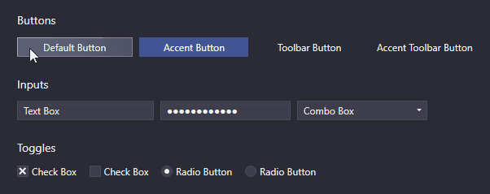

# Ripple effect

The ripple effect consists of an ellipse that expands on click with its center set to the click position. Buttons and ContextMenuItems show a ripple effect on click by default. ListBoxItems support it as well but have it disabled by default. 




## Customization

Properties of the ripple effect can be customized using the `RippleExtension`.

### Colors

The ripple effect makes use of a background brush, a border brush and a foreground brush. By default, their values are provided by the `Interaction` colors of the respective layer (See [Colors and Brushes](colors-and-brushes)). To set them directly on individual controls, use the `RippleExtension`:

```xml
<!-- xmlns:adonisExtensions="clr-namespace:AdonisUI.Extensions;assembly=AdonisUI" -->
<Button adonisExtensions:RippleExtension.BackgroundBrush="Red"
        adonisExtensions:RippleExtension.BorderBrush="Red"
        adonisExtensions:RippleExtension.ForegroundBrush="White"/>
```

### Durations

The ripple effect uses an animation to appear and afterwards another one to disappear. For both animations the duration can be controlled separately. For the first one use `FadeInDuration` and for the second one `FadeOutDuration`. Both are set to 200 milliseconds by default. Their values are inherited to children so they can be set for individual controls, containers like grids or windows or the whole application.

```xml
<!-- xmlns:adonisExtensions="clr-namespace:AdonisUI.Extensions;assembly=AdonisUI" -->
<Button adonisExtensions:RippleExtension.FadeInDuration="200"
        adonisExtensions:RippleExtension.FadeOutDuration="200"/>
```

## Remarks about ripple foreground

**TL;DR:**

The `RippleExtension.ForegroundBrush` can only be applied for contents of primitive type, strings and structs. More complex content including other child controls must be set as `ContentTemplate`.

**Detailed explanation:**

To enable the foreground to change together with the ripple ellipse, the content of a control like a button exists twice. One is the normal content and the other one is a copy on a separate ripple layer. The ripple layer uses its own foreground which allows for transitioning between the two otherwise identical contents.

*Note: A simple color animation is not an option here, because unfortunately animations do not support Bindings or DynamicResources in WPF, which are required to support color scheme switching.*

The drawback with having the content twice is that not every kind of content can be used twice so easily. The chosen way works for all primitive values as well as strings and structs out of the box. Problems arise for content that is referred to by reference. That means that e.g. a button having string content works totally fine while a button having other controls inside is not compatible. Being not compatible means that the child controls unfortunately can only be displayed once. To display them again on the ripple layer, they could be cloned, but this is not trivial to accomplish and would probably drop things like Bindings on the created clone. AdonisUI is able to detect the problem and uses the content on the normal content layer only. It ensures that even when the ripple is active, the content is displayed, but it is not able to apply the ripple foreground brush in this case which leaves the content with the default foreground brush.

To have complex content and still get the ripple foreground brush applied, the content needs to be set as `ContentTemplate` instead of `Content`. Items in DataTemplates can be instantiated multiple times and thus do not cause any issues.

Because not every control that supports the ripple effect has the `ContentTemplate` property, it is provided as *AttachedProperty* for the missing cases:

- `MenuItemExtension.IconTemplate` for serving the icon of an context menu item as data template
